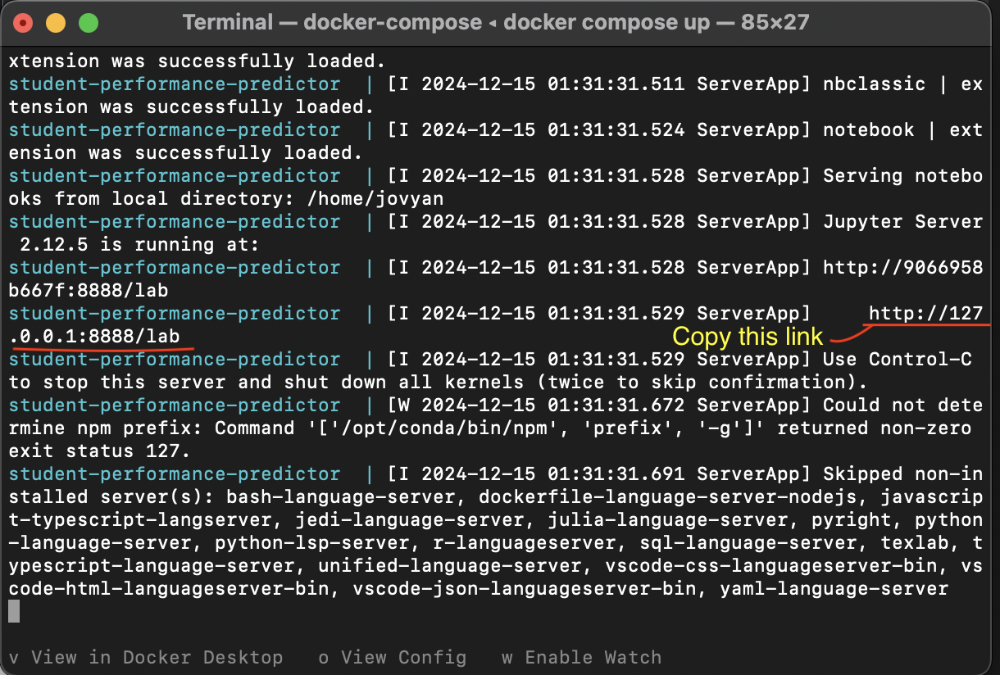

# Predicting Academic Performance in Mathematics using Demographic and Student Behavioral Data

## dsci-522-group-23

### Author: Zhengling Jiang, Colombe Tolokin, Franklin Aryee, Tien Nguyen

## Summary

This project investigates whether a student's mathematics performance can be predicted with linear regression using demographic and behavioral data, aiming to help educators in supporting students and tailoring educational strategies.

## Usage

This section details the step to install the softwares and packages to run the analysis

### Clone the git repository from GitHub

In your terminal, please run the following commands:

```bash
git clone git@github.com:UBC-MDS/dsci-522-group-23.git
```

or 

```bash
git clone https://github.com/UBC-MDS/dsci-522-group-23.git
```

### Launch Jupyter Lab and run the analyses

1. Navigate to the root of this project on your computer and run the following command to create and start containers:

     ```bash
    docker compose up
    ```

2. In the terminal, look for a URL: `http://127.0.0.1:8888/lab`. Copy and paste the URL into your browser and change `8888` to `8889` manually.

   
   
   

4. To run the analysis, open `notebooks/student_performance_predictor_report.ipynb` in the Jupyterlab that just launched and click "Restart Kernel and Run All Cells..." under the "Kernel" menu.

### Regenerate the artifacts (datasets, figures, tables, html file, etc) in the analysis

Make sure you are in the root directory of the project (`work` directory of the Docker notebook). Open the **Terminal GUI of the Docker Jupyter Lab** and run

```bash
make clean
make all
```

To rerun the unit tests:

```bash
make tests
```

### Clean Up

1. Shut Down the Container

    To stop the container, press Ctrl + C in the terminal where you launched the container using docker compose up.

2. Remove the Container

Once the container is stopped, remove it and its associated resources by running:

 ```bash
 docker compose rm
 ```

Navigate to the notebook file [student_performance_predictor_report.ipynb](notebooks/student_performance_predictor_report.ipynb) to view or rerun the analysis as you wish.

## Dependencies

- `conda`: Version 23.9.0 or higher

- `conda-lock`: Version 2.5.7 or higher

- Python and packages listed in [environment.yml](environment.yml) or [conda-lock.yml](conda-lock.yml)

### Update the Container

If you need to change the container, follow this workflow:

1. Add the new dependency or any chagnes in the `emvironment.yml` file.

2. Update the lock file: run

    ```bash
    conda-lock -k explicit --file environment.yml -p linux-64 
    ```

to update the conda-linux-64.lock file.

1. Build the Docker image locally to test it and verify the container starts correctly. Make sure you're in the root directory of the project. The command you can use is:

    ```bash
    docker build -t <image-tag> --platform=linux/amd64 .
    ```

    ```bash
    docker run --platform linux/amd64 \
    -p 8889:8888 \
    -v "$(pwd):/home/jovyan/work" \
    --name student-performance-predictor \
        <image-name:image-tag>
    ```

    > Replace `<image-tag>` and `<image-name> `with the proper values you want to name it

1. Push the updated branch to Github. The updated image will be automatically built and pushed to Docker Hub with the GitHub Workflows. The tag of that auto-build image is the same as the commit SHA.
1. Modify the docker-compose.yml file to reference the updated Docker image. Commit the changes to the same branch.
1. Open a PR to merge your branch into the main branch.

## License

The project follows a dual licensing structure:

- The project code is licensed under the [MIT License](https://opensource.org/license/MIT). See the [LICENSE.md](https://github.com/UBC-MDS/dsci-522-group-23/blob/main/LICENSE.md) file for details.
- The project report is licensed under the [Creative Commons Attribution-NonCommercial-NoDerivatives 4.0 International (CC BY-NC-ND 4.0) license](https://creativecommons.org/licenses/by-nc-nd/4.0/).

If re-using or re-mixing this project, please ensure proper attribution and adherence to the terms of the respective licenses.

## Contributing

Please see the [Contributing Guidelines](CONTRIBUTING.md) for proper procedures to contribute to our project.
